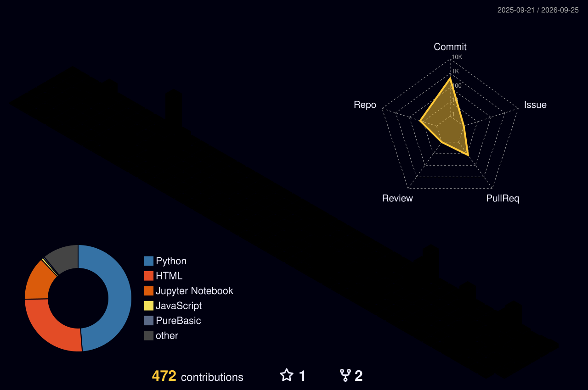

# Seonhyung Kim

**Perception engineer in the making - I build the vision side of self-driving systems.**

B.S. in Artificial Intelligence Engineering, Sookmyung Women's University

---

## About Me

I'm interested in the path from raw camera and LiDAR data all the way to a vehicle that actually moves.
My work centers on object detection, lane perception, sensor fusion, and getting all of it running as a real pipeline on ROS.

- Perception development across simulation (MORAI, CARLA) and small physical platforms
- End-to-end driving research on an RC car built around PilotNet
- Applied AI services on Microsoft Azure

Some of my current work lives in private repositories. Happy to walk through it on request.

---

---
## Tech Stack

**Languages**

**AI / Vision**

**Robotics / Simulation**

**Cloud**

**Tools**

---

## Projects

###  End-to-End Autonomous Driving with PilotNet

[`seonhyung021/autonomous-car`](https://github.com/seonhyung021/autonomous-car)

An RC car that learns to drive from camera input alone, extending NVIDIA's end-to-end approach into a **multi-output regression model that predicts steering angle and speed together.**

- Data collection pipeline on a Raspberry Pi platform (camera + ToF sensor), with stage-by-stage debug image logging
- Systematic learning-rate and scheduler experiments on the training pipeline
- Obstacle avoidance module built as a four-state machine (AVOID → STRAIGHT → RETURN → NORMAL) with linear interpolation blending on entry and exit

###  MuMulYak — Azure-Based Medication Identification & Guidance

[`seonhyung021/winter-team5`](https://github.com/seonhyung021/winter-team5) · Sookmyung Azure Winter School, Team 5

A service that identifies a medication from a single photo and generates plain-language guidance on how to take it.

- **Azure Custom Vision** for pill image classification, with confidence scores
- **Azure AI Vision (OCR)** as a second classification pass to raise accuracy on pill surface text
- **Azure OpenAI (GPT)** to generate descriptions, dosage instructions, and warnings in natural Korean
- **Gradio** frontend with custom CSS — card-based mobile-style UI, separate landing and function screens
- Images are used only transiently for analysis and never stored

###  SafeStep — Location-Aware Fall Detection & Emergency Response

[`seonhyung021/SafeStep`](https://github.com/seonhyung021/SafeStep) · Open Source Programming course team project · owned the **CNN location classifier**

A real-time system that detects falls and escalates differently depending on *where* the fall happened — stairs are treated as high-risk, flat ground as low-risk.

- **My module:** ResNet18 transfer learning (ImageNet weights, FC layer replaced for 2-class stair/ground classification), Adam lr=5e-4, class-weighted CrossEntropyLoss
- **99.2%** accuracy on stair classification, **92%+** on ground
- Resolved dataset issues: class imbalance, HEIC conversion, corrupted PNGs
- Integrated with teammates' MediaPipe Pose fall detection (hip–knee inversion, torso tilt angle, bounding-box aspect ratio) and a gTTS/Google STT emergency dialogue that escalates to an emergency call on no response

---

## Coursework & Interests

- **Image Processing** — MFC implementations of histogram equalization and stretching, morphological operations, noise filters, edge detection (Laplacian, Sobel across YCbCr/RGB/HSI), PSNR measurement, geometric transforms, and face detection via YCbCr skin-color segmentation
- **Machine Learning / Pattern Recognition** — CNNs, RNNs, LSTM/GRU, attention, backpropagation, regularization, cross-validation
- **Applied ML** — scikit-learn pipelines (SVM + StandardScaler + RandomizedSearchCV), decision trees, AWS SageMaker Studio

---

